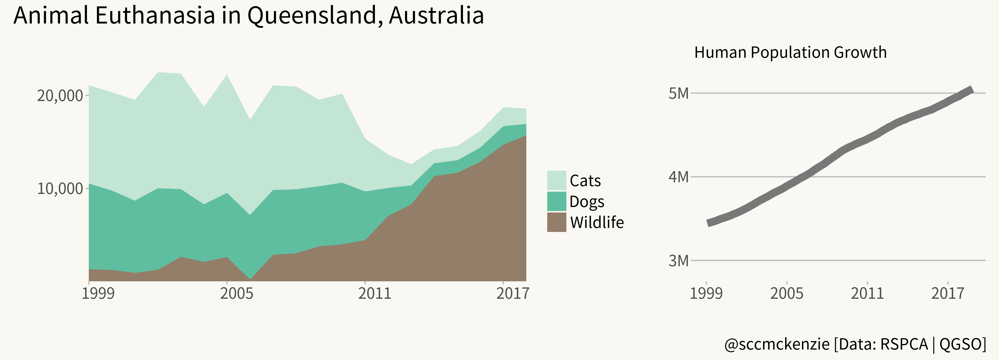

# #TidyTuesday

Contributions to the R4DS Online Learning Community Project

---

2020-07-21 - [Code](animal-outcomes/animal-outcomes.R) - [Post](https://github.com/rfordatascience/tidytuesday/blob/master/data/2020/2020-07-21/readme.md)

---

2020-07-14 - [Code](astronauts/astronauts.R) - [Post](https://github.com/rfordatascience/tidytuesday/blob/master/data/2020/2020-07-14/readme.md)

---

2020-03-25 - [Code](tbi/tbi.R) - [WSJ Data](https://github.com/WSJ/measles-data) - [Post](https://github.com/rfordatascience/tidytuesday/blob/master/data/2020/2020-03-24/readme.md)

---

2020-02-25 - [Code](measles/measles.R) - [Post](https://github.com/rfordatascience/tidytuesday/blob/master/data/2020/2020-02-25/readme.md)

---

2020-02-17 - [Code](food_consumption/food_consumption.R) - [Post](https://github.com/rfordatascience/tidytuesday/tree/master/data/2020/2020-02-18/readme.md)

